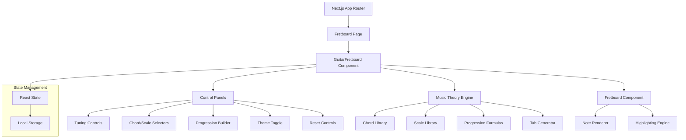

# Design Document

## Overview

The Guitar Fretboard Tool is a React-based web application built with Next.js that provides interactive guitar learning capabilities. The application uses a component-based architecture to deliver real-time fretboard visualization, music theory exploration, and educational tools for guitarists of all levels.

The design emphasizes modularity, performance, and user experience through responsive design patterns and efficient state management. The application leverages modern web technologies including React hooks, CSS-in-JS styling, and Bootstrap for consistent UI components.

## Architecture

### High-Level Architecture



### Component Hierarchy

- **App Layout**: Root layout with theme provider and global styles
- **FretboardPage**: Main page component that renders the guitar fretboard tool
- **GuitarFretboard**: Primary container component managing all application state
- **Fretboard**: Reusable fretboard visualization component
- **ControlPanel**: Collection of input controls for user interaction
- **TabDisplay**: Component for rendering guitar tablature notation
- **ProgressionDisplay**: Container for chord progression with interspersed tab phrases

### Layout Design for Musical Phrases

The application uses a sequential layout pattern for chord progressions with integrated musical phrases:

```
[Chord 1 Fretboard]
[Tab Phrase 1→2]
[Chord 2 Fretboard]
[Tab Phrase 2→3]
[Chord 3 Fretboard]
[Tab Phrase 3→4]
[Chord 4 Fretboard]
```

This design ensures that musical phrases serve as connecting elements between chord changes, providing smooth melodic transitions that guitarists can practice to improve their improvisation skills.

## Components and Interfaces

### Core Components

#### GuitarFretboard Component

```typescript
interface GuitarFretboardProps {
  initialTheme?: 'light' | 'dark';
}

interface GuitarFretboardState {
  tuning: string[];
  selectedChord: string;
  selectedScale: string;
  progressionKey: string;
  progressionFormula: number;
  chordProgression: ChordProgressionEntry[];
  theme: 'light' | 'dark';
  generatedTabs: TabPhrase[];
}
```

#### Fretboard Component

```typescript
interface FretboardProps {
  tuning: string[];
  totalFrets: number;
  chordName?: string;
  chordNotes?: string[];
  scaleNotes?: string[];
  title?: string;
  theme: 'light' | 'dark';
}
```

#### TabDisplay Component

```typescript
interface TabDisplayProps {
  phrase: TabPhrase;
  tuning: string[];
  theme: 'light' | 'dark';
  position: 'between-chords' | 'standalone';
}

interface TabPhrase {
  chordName: string;
  notes: TabNote[];
  pattern: 'ascending-run' | 'descending-run' | 'arpeggiated' | 'mixed';
}

interface TabNote {
  string: number; // 0-5 (high E to low E)
  fret: number;
  timing?: number; // for rhythm notation
}
```

### Music Theory Engine

#### Chord and Scale Libraries

```typescript
interface ChordDefinition {
  name: string;
  notes: string[];
  intervals: number[];
}

interface ScaleDefinition {
  name: string;
  notes: string[];
  intervals: number[];
}

interface ProgressionFormula {
  label: string;
  pattern: number[];
  isMinor: boolean;
}
```

#### Tab Generation Engine

```typescript
interface TabGenerator {
  generatePhrase(chordNotes: string[], scaleNotes: string[], tuning: string[], options: GenerationOptions): TabPhrase;
  generateConnectingPhrase(fromChord: string[], toChord: string[], scaleNotes: string[], tuning: string[]): TabPhrase;
}

interface GenerationOptions {
  phraseLength: number; // 4-12 notes for longer melodic runs
  preferredPosition: number; // fret position
  emphasizeChordTones: boolean;
  patternType: 'ascending-run' | 'descending-run' | 'arpeggiated' | 'mixed';
  rhythmPattern?: string;
}
```

## Data Models

### Music Theory Data Structures

#### Note System

- **Chromatic Notes**: Array of 12 semitones ["A", "A#", "B", "C", "C#", "D", "D#", "E", "F", "F#", "G", "G#"]
- **Note Calculation**: Modular arithmetic for fret position calculations
- **Enharmonic Equivalents**: Support for both sharp and flat notation

#### Chord System

```typescript
const chordFormulas = {
  'Major': [0, 4, 7],
  'Minor': [0, 3, 7],
  'Maj7': [0, 4, 7, 11],
  '7': [0, 4, 7, 10],
  'm7': [0, 3, 7, 10],
  'Sus4': [0, 5, 7],
  'Add9': [0, 4, 7, 2],
};
```

#### Scale System

````typescript
const scaleFormulas = {
  'Major': [0, 2, 4, 5, 7, 9, 11],
  'Minor': [0, 2, 3, 5, 7, 8, 10],
  'Pentatonic Major': [0, 2, 4, 7, 9],
  'Pentatonic Minor': [0, 3, 5, 7, 10],
  'Blues': [0, 3, 5, 6, 7, 10],
  'Harmonic Minor': [0, 2, 3, 5, 7, 8, 11],
  'Melodic Minor': [0, 2, 3, 5, 7, 9, 11],
  'Phrygian': [0, 1, 3, 5, 7, 8, 10],
  'Phrygian Dominant': [0, 1, 4, 5, 7, 8, 10],
};

#### Musical Phrase Patterns

```typescript
const phrasePatterns = {
  'ascending-run': {
    description: 'Ascending scale passages with position shifts',
    example: 'E|-----0-1-3-5---0-1-3-5---',
    algorithm: 'generateAscendingRun',
  },
  'descending-run': {
    description: 'Descending melodic lines emphasizing chord tones',
    example: 'G|---------0---1-2---2-1-0-',
    algorithm: 'generateDescendingRun',
  },
  'arpeggiated': {
    description: 'Broken chord patterns across multiple strings',
    example: 'Mixed string arpeggiation with connecting notes',
    algorithm: 'generateArpeggiatedPhrase',
  },
  'mixed': {
    description: 'Combination of scalar and arpeggiated elements',
    example: 'Contextual phrases based on chord progression',
    algorithm: 'generateMixedPhrase',
  },
};
````

````

### State Management

#### Application State

```typescript
interface AppState {
  // Guitar Configuration
  tuning: string[];

  // Music Theory Selection
  selectedChord: string;
  selectedScale: string;

  // Progression Builder
  progressionKey: string;
  progressionFormulaIndex: number;
  chordProgression: ChordProgressionEntry[];

  // UI Preferences
  theme: 'light' | 'dark';

  // Generated Content
  generatedTabs: Map<string, TabPhrase>;
  connectingPhrases: TabPhrase[]; // Phrases positioned between chords
}
````

#### Persistence Strategy

- **Local Storage**: Theme preferences, tuning presets, favorite progressions
- **Session Storage**: Current selections, generated tabs
- **URL Parameters**: Shareable configurations for educational purposes

## Error Handling

### Input Validation

- **Tuning Validation**: Ensure all tuning selections are valid chromatic notes
- **Chord/Scale Validation**: Verify selections exist in music theory libraries
- **Progression Validation**: Validate chord progression entries and key relationships

### Error Recovery

```typescript
interface ErrorBoundary {
  // Graceful degradation for invalid music theory inputs
  fallbackToDefaults(): void;

  // Recovery from state corruption
  resetToInitialState(): void;

  // User-friendly error messages
  displayErrorMessage(error: MusicTheoryError): void;
}
```

### Performance Considerations

- **Memoization**: Cache chord and scale calculations using React.useMemo
- **Lazy Loading**: Load progression formulas and tab generation on demand
- **Debouncing**: Prevent excessive re-renders during rapid user input

## Testing Strategy

### Unit Testing

- **Music Theory Engine**: Test chord and scale generation algorithms
- **Note Calculation**: Verify fret position calculations across all tunings
- **Tab Generation**: Test musical phrase generation with various inputs
- **State Management**: Test state transitions and persistence

### Integration Testing

- **Component Interaction**: Test communication between fretboard and controls
- **Theme Switching**: Verify theme changes propagate correctly
- **Progression Generation**: Test end-to-end chord progression workflows

### User Experience Testing

- **Responsive Design**: Test across different screen sizes and devices
- **Accessibility**: Verify keyboard navigation and screen reader compatibility
- **Performance**: Test rendering performance with multiple fretboards

### Test Data

```typescript
const testCases = {
  tunings: [
    ['E', 'A', 'D', 'G', 'B', 'E'], // Standard
    ['D', 'A', 'D', 'G', 'A', 'D'], // DADGAD
    ['C', 'G', 'C', 'F', 'A', 'D'], // Open C
  ],
  chords: ['C Major', 'Am', 'F Maj7', 'G7'],
  scales: ['C Major', 'A Minor', 'C Pentatonic Major'],
  progressions: [
    { key: 'C', formula: 0 }, // Folk progression
    { key: 'Am', formula: 6 }, // Minor progression
  ],
};
```

## Theme System Design

### CSS Custom Properties

```css
:root {
  --bg-primary: #ffffff;
  --bg-secondary: #f8f9fa;
  --text-primary: #212529;
  --text-secondary: #6c757d;
  --accent-chord: #ffd966;
  --accent-scale: #cfe2f3;
  --border-color: #dee2e6;
}

[data-theme='dark'] {
  --bg-primary: #1a1a1a;
  --bg-secondary: #2d2d2d;
  --text-primary: #ffffff;
  --text-secondary: #b0b0b0;
  --accent-chord: #ffb347;
  --accent-scale: #87ceeb;
  --border-color: #404040;
}
```

### Theme Context

```typescript
interface ThemeContext {
  theme: 'light' | 'dark';
  toggleTheme: () => void;
  setTheme: (theme: 'light' | 'dark') => void;
}
```

## Accessibility Considerations

### Keyboard Navigation

- **Tab Order**: Logical tab sequence through all interactive elements
- **Focus Indicators**: Clear visual focus indicators for all controls
- **Keyboard Shortcuts**: Optional shortcuts for common actions

### Screen Reader Support

- **ARIA Labels**: Descriptive labels for all fretboard positions and controls
- **Live Regions**: Announce chord and scale changes to screen readers
- **Semantic HTML**: Proper heading hierarchy and landmark elements

### Visual Accessibility

- **Color Contrast**: WCAG AA compliant contrast ratios for all text and highlights
- **Color Independence**: Ensure functionality doesn't rely solely on color
- **Scalable Text**: Support for browser zoom up to 200%

## Clean Interface Design

### Live-Only Content Strategy

The application follows a "live-only" design philosophy that eliminates static demo content and focuses entirely on interactive functionality:

#### Content Principles

- **No Static Demos**: All displayed content must be generated from user interactions
- **Immediate Feedback**: Every control provides instant visual feedback on fretboards
- **Functional Focus**: Interface elements serve specific musical learning purposes
- **Clean State**: Default state shows neutral fretboards ready for user input

#### Interface Organization

```typescript
interface CleanInterfaceLayout {
  controlPanel: {
    tuningControls: TuningSelector[];
    musicTheorySelectors: ChordScaleSelector[];
    progressionBuilder: ProgressionControls[];
    utilityControls: ResetButton | ThemeToggle[];
  };
  displayArea: {
    mainFretboard?: Fretboard; // Only when single chord/scale selected
    progressionSequence?: ProgressionDisplay; // Only when progression active
    tabPhrases?: TabDisplay[]; // Only when phrases generated
  };
}
```

#### Dynamic Content Rules

- **Conditional Rendering**: Components only render when relevant to current user selections
- **Progressive Disclosure**: Advanced features appear only when prerequisite selections are made
- **State-Driven Display**: All visual content derives from application state, not hardcoded examples
